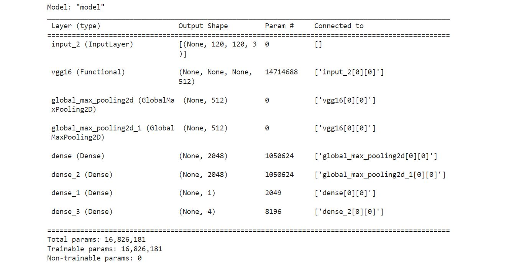

# 🤓 Real-Time Face Tracker
Access Notebook: [facetracker](notebook.ipynb)

## What is Object Detection?
Object detection is a computer vision task that has recently been influenced by the progress made in Machine Learning. This technology has seen a rapid adoption rate in various and diverse industries. It helps self-driving cars safely navigate through traffic,  assists sports teams analyze and build scouting reports and many other things.

So, how does this model work? An image is fed to the system. The system then detects the object in the image and draws a bounding box around the object. That's the basic idea.

## Data Processing
A total of 60 images were captured from webcam. The object(face) in the image were then labelled using a powerful annotation tool `labelme`. The data is not adequate to train the model, therefore, an image augmentation tool `albumentations` was used to enlarge the dataset to around 3600 images.

- ### Labelme
    Labelme is a graphical image annotation tool inspired by http://labelme.csail.mit.edu. It is written in Python and uses Qt for its graphical interface.
Learn more about labelme [here](https://github.com/wkentaro/labelme).

- ### Albumentaions
    Albumentations is a fast and flexible image augmentation library. The library is widely used in industry, deep learning research, machine learning competitions, and open source projects. Albumentations is written in Python, and it is licensed under the MIT license. Learn more about albumentations [here](https://albumentations.ai/).

- ### What is image augmentation?
    Image augmentation is a process of creating new training examples from the existing ones. To make a new sample, you slightly change the original image. For instance, you could make a new image a little brighter; you could cut a piece from the original image; you could make a new image by mirroring the original one, etc. By applying those transformations to the original training dataset, you could create an almost infinite amount of new training samples.

## Model
This model is a mix of both classification and Regression. Classification model helps in classifying whether a face is present or not. Regression model helps in drawing bounding box around the face using co-ordinates. Transfer learning is used with VGG16 architecture to build the model.

